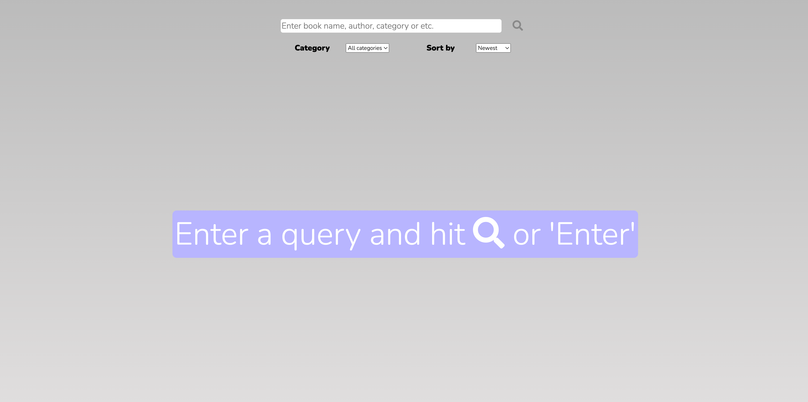
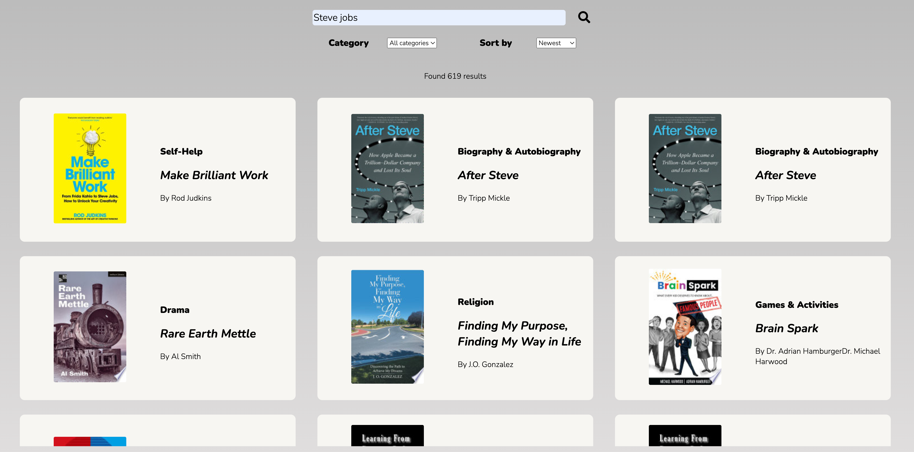
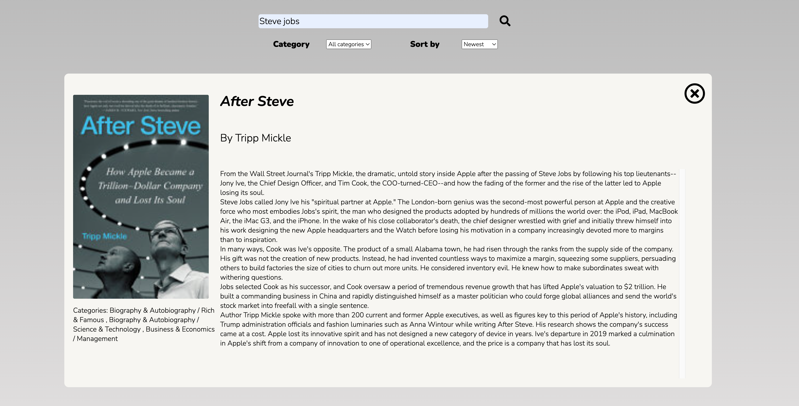
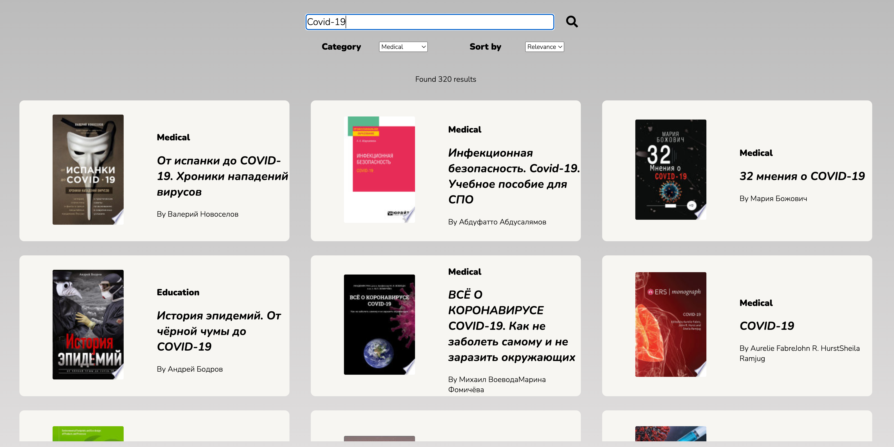

# Описание 

Используя Google Books API, это веб-приложение позволяет пользователю вводить в поисковике желаемые имя автора или название книги, и получать результаты с деталями каждой найденной книги.

## Требуется
* Git
* npm/npx
* create-react-app (`npm install -g create-react-app`)
* serve (`npm install -g serve`)

## Для запуска приложения

1) Скачайте этот репозиторий
2) Войдите в папку репозитория
3) Напишите в терминале 
   1) `npm start` для версии девелопмента
   2) `npm run build`, а затем `serve -s build` для версии продакшн (если у вас нет *serve*, пожалуйста, установите его с помощью `npm install -g serve`)
   3) `npm run parcel:build` для версии **parcel**, которая подстроит приложения под ваш браузер и ОС (если у вас нет *parcel*, пожалуйста, установите его с помощью `npm install --save-dev parcel`)

Если у вас имеется Docker и Git (очевидно), вы можете также запустить контейнер с картинкой этого приложения в Docker, исполнив следующие команды:

1) `docker build -t ggl-books-search:1.0.0-prod .`
2) `docker run --rm -it --name web -p 3000:80 ggl-books-search:1.0.0-prod`
3) Затем войдите в *http://localhost:3000* на своей системе.

# Description 

Using the Google Books API, this web-app allows the user to enter desired author or book name, and receive results with details on each returned entry.

## Required
* Git
* npm/npx
* create-react-app (`npm install -g create-react-app`)
* serve (`npm install -g serve`)
  
## To start the app

1) Download or clone this repository
2) Enter the folder of this repository
3) In your terminal, write, one of the following:
   1) `npm start` for a development versions 
   2) `npm run build`, and then `serve -s build` for a production version (if you don't have *serve* installed, please run `npm install -g serve`)
   3) `npm run parcel:build` for a **parcel** version, which will adjust the app according to your browser and OS (if you don't have *parcel*, please install it with `npm install --save-dev parcel`)

If you have Docker and Git installed, you can also launch a container with an image of this app in Docker by sequentially executing the following commands:

1) `docker build -t ggl-books-search:1.0.0-prod .`
2) `docker run --rm -it --name web -p 3000:80 ggl-books-search:1.0.0-prod`
3) Then go to *http://localhost:3000* on your system.

## Screenshots

